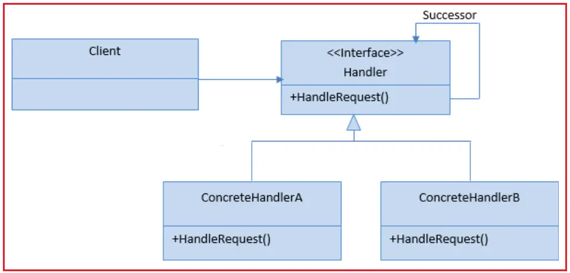

# C# Chain Of Responsibility Design Pattern
The Chain of Responsibility design pattern avoids coupling the sender of a request to its receiver by giving more than one object a chance to handle the request. This pattern chains the receiving objects and passes the request along the chain until an object handles it.  
>Chain of Resp : A way of passing a request between a chain of objects. 

## UML class diagram

## UML class diagram with example
