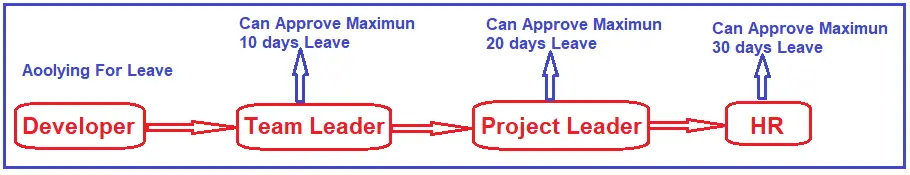

# C# Chain Of Responsibility Design Pattern
The Chain of Responsibility design pattern avoids coupling the sender of a request to its receiver by giving more than one object a chance to handle the request. This pattern chains the receiving objects and passes the request along the chain until an object handles it.  
>Chain of Resp : A way of passing a request between a chain of objects. 

## UML class diagram

* Handler: This will be an abstract class that defines how the request will be handled. It contains a member that holds the next handler in the chain and an associated method to set this next handler. It also has an abstract method that concrete handler classes will implement to handle the incoming request, and if required, it will pass the request to the next handler object in the pipeline. In our example, it is the Handler abstract class. The member is NextHandler, the associated method is SetNextHandler, and the abstract method is DispatchNote.
* ConcreteHandlerA and ConcreteHandlerB: These will be concrete classes inherited from the Handler abstract class and provide implementations for the abstract method. This method has the logic to handle the request. If required, then it will forward the request to the next handler associated with the pipeline. In our example, it is the DispatchNote method of the TwoThousandHandler, FiveHundredHandler, TwoHundredHandler, and HundredHandler classes.
* Client: This class generates the request and passes it to the first handler in the chain of responsibility. In our example, we have simplified this using the ATM class, and the client will call the Withdraw method of the ATM class.

## UML class diagram with example
