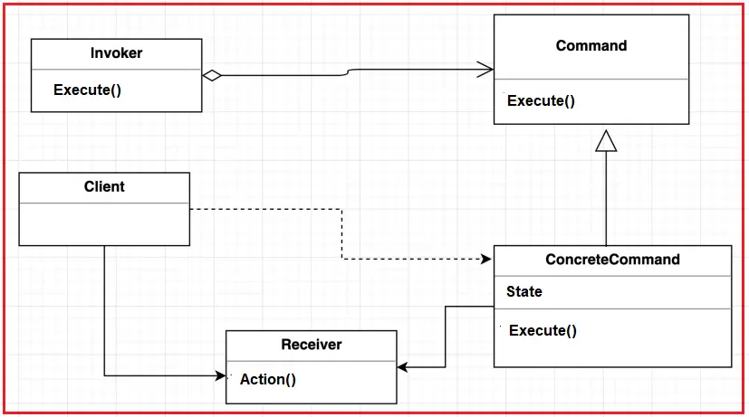
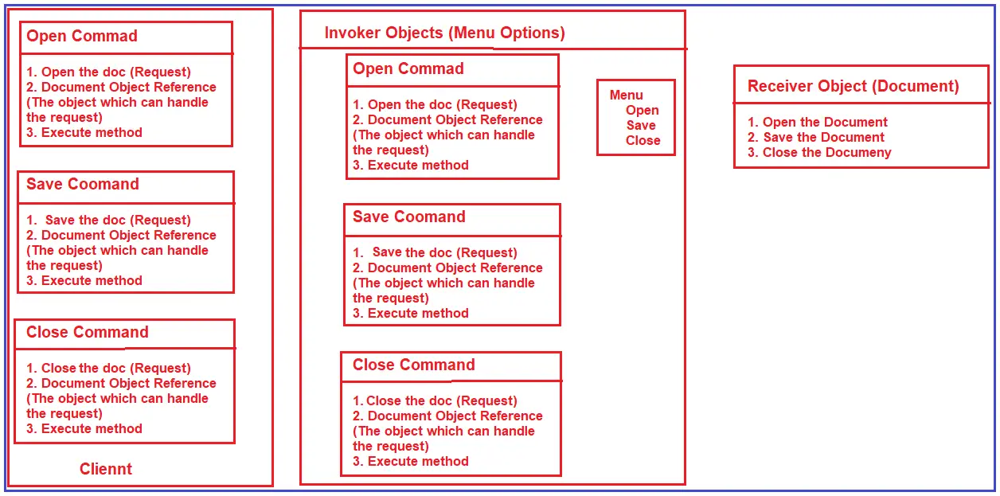

# C# Command Design Pattern
The Command design pattern encapsulates a request as an object, thereby letting you parameterize clients with different requests, queue or log requests, and support undoable operations. 
>Command : Encapsulate a command request as an object. 

## UML class diagram

* Command  
declares an interface for executing an operation
* ConcreteCommand  
defines a binding between a Receiver object and an action
implements Execute by invoking the corresponding operation(s) on Receiver
* Client  
creates a ConcreteCommand object and sets its receiver
* Invoker  
asks the command to carry out the request
* Receiver  
knows how to perform the operations associated with carrying out the request.

## UML class diagram with example

* Receiver: This class contains the actual implementation of the method the client wants to call. Our example is the Document class’s Open, Save, and Close method.
* Command: This will be an interface specifying the Execute operation. In our example, the ICommand interface has only one method, i.e., Execute.
* ConcreteCommand: These classes will implement the ICommand interface and provide implementations for the Execute operation. As part of the Execute method, it will invoke operation(s) on the Receiver object. Our example is the OpenCommand, SaveCommand, and CloseCommand classes.
* Invoker: The Invoker will be a class and ask the command to carry out the action. In our example, it is the MenuOptions class.
* Client: This is the class that creates and executes the command object. In our example, it is the Main method of the Program class.