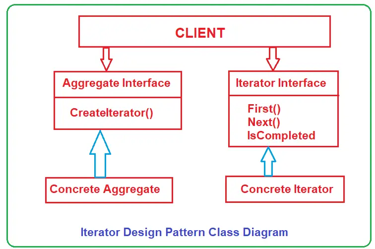

# C# Iterator Design Pattern
The Iterator design pattern provides a way to access the elements of an aggregate object sequentially without exposing its underlying representation.  
>Iterator : Sequentially access the elements of a collection. 

## UML class diagram

* Iterator (IAbstractIterator): This interface will define the operations for accessing and traversing elements in a sequence. In our example, it is the IAbstractIterator interface.
* ConcreteIterator (Iterator): This will be a concrete class implementing the Iterator interface and providing implementations for Iterator interface methods. This class also keeps track of the element’s current position in the traversal. In our example, it is the Iterator class.
* Aggregate (IAbstractCollection): This interface defines an operation to create an iterator object. In our example, it is the CreateIterator() method of the IAbstractCollection interface.
* ConcreteAggregate (ConcreteCollection): This will be a concrete class that implements the AbstractCollection interface to return an instance of the proper Concrete Iterator class, i.e., an instance of the Iterator class. In our example, it is the ConcreteCollection class.
* Client: This class will use the Iterator and Aggregate interfaces and access the elements. In our example, it is the Main method of the Program class.

