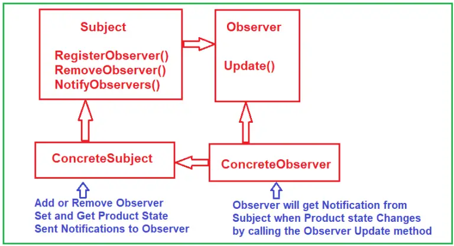

# C# Observer Design Pattern
The Observer design pattern defines a one-to-many dependency between objects so that when one object changes state, all its dependents are notified and updated automatically.  
>Observer : A way of notifying change to a number of classes. 

## UML class diagram with example

* Subject: This interface will declare the operations for adding and removing observers and send notifications to the registered observers when the subject state changes. We can add any number of observers. In our example, it is the ISubject interface.
* ConcreteSubject: This will be a concrete class, and this class should implement the Subject interface. This class maintains its own state, and when the state is changed, it will send notifications to all observers by calling the observer’s update method. In our example, it is the Subject class.
* Observer: This will be an interface that defines an updating interface for objects that should be notified when the subject state changes. In our example, it is the IObserver interface.
* ConcreteObserver: This will be a class that implements the Observer interface. This interface provides one method to determine what changes have occurred with the subject. The Subject will call this Observer method to send the notification. In our example, it is the Observer class.