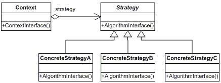
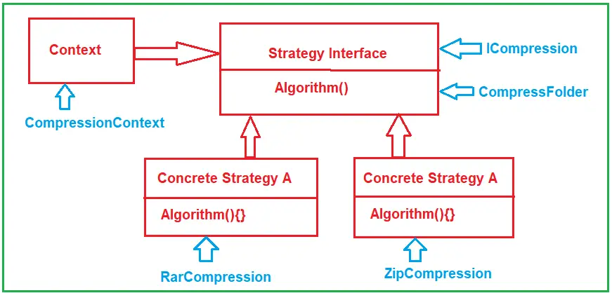

# C# Strategy Design Pattern
The Strategy design pattern defines a family of algorithms, encapsulate each one, and make them interchangeable. This pattern lets the algorithm vary independently from clients that use it.  
>Strategy : Encapsulates an algorithm inside a class. 

## UML class diagram

* Strategy  
declares an interface common to all supported algorithms. Context uses this interface to call the algorithm defined by a ConcreteStrategy.
* ConcreteStrategy  
implements the algorithm using the Strategy interface
* Context  
is configured with a ConcreteStrategy object 
maintains a reference to a Strategy object 
may define an interface that lets Strategy access its data. 

## UML class diagram with example

* Strategy: The Strategy declares an interface that all supported algorithms will implement. Here, algorithms mean methods that the concrete strategy classes will implement. In our example, it is the CompressFolder method of the ICompression interface.
* ConcreteStrategy: These will be concrete classes, and they must implement the Strategy (ICompression) interface and provide implementations for the algorithm, i.e., implementing the interface methods. In our example, it is the RarCompression and ZipCompression classes.
* Context: This class will maintain a reference to a Strategy object and then use that reference to call the algorithm defined by a particular ConcreteStrategy (i.e., either RarCompression or ZipCompression). In our example, it is the CompressionContext class.