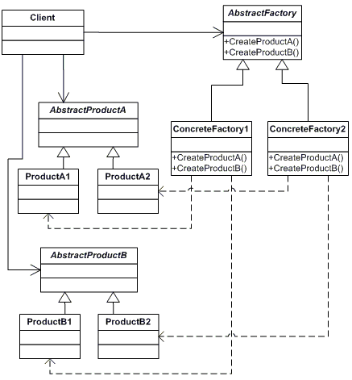
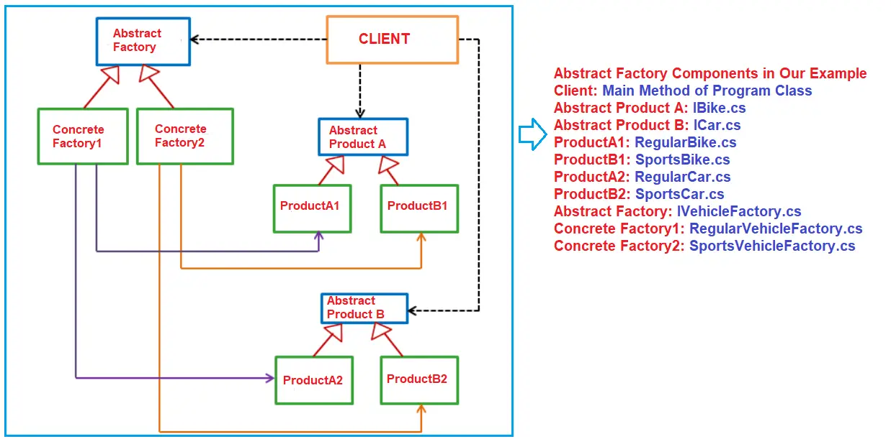

# C# Abstract Factory Design Pattern
The Abstract Factory design pattern provides an interface for creating families of related or dependent objects without specifying their concrete classes.  

## UML class diagram
A visualization of the classes and objects participating in this pattern. 

The classes and objects participating in this pattern include:

* AbstractFactory: declares an interface for operations that create abstract products
* ConcreteFactory: implements the operations to create concrete product objects
* AbstractProduct: declares an interface for a type of product object
* Product: defines a product object to be created by the corresponding concrete factory implements the AbstractProduct interface
* Client: uses interfaces declared by AbstractFactory and AbstractProduct classes

## UML class diagram with example

* Abstract Products: These are going to be interfaces for creating abstract products. Here, we need to define the Operations a Product should have. In our example, it is IBike.cs and ICar.cs interfaces.
* Concrete Products: These are the classes that implement the Abstract Product interface. In our example, RegularBike, SportsBike, RegularCar, and SportsCar classes are the Concrete Products.
* Abstract Factory: This will be an interface for operations that will create Abstract Product objects. In our example, it is going to be IVehicleFactory.
* Concrete Factory: These classes implement the AbstractFactory interface and provide implementations for the interface methods. In our example, RegularVehicleFactory and SportsVehicleFactory are the concrete factory classes.
* Client: It is the class that is going to use the Abstract Product and Abstract Factory to create a family of products. In our example, it is the Main method of the Program class.