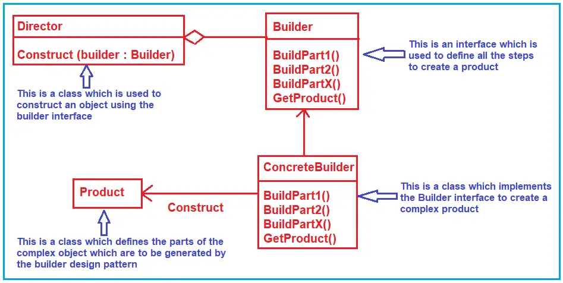
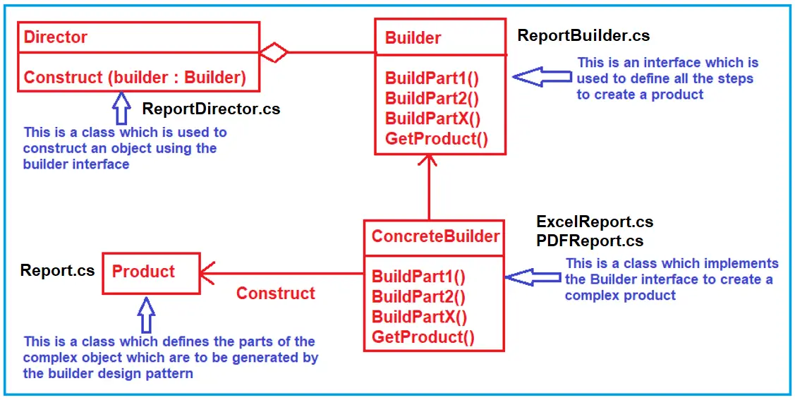

# C# Builder Design Pattern
The Builder design pattern separates the construction of a complex object from its representation so that the same construction process can create different representations.  
>Builder : Separates object construction from its representation

## UML class diagram

To separate the construction process from its representation, the builder design pattern Involve four components. They are as follows. 

* Abstract Builder: The Builder is an interface defining all the steps to make the concrete product. 
* Concrete Builder: The Concrete Builder Classes implements the Abstract Builder interface and provides implementation to all the abstract methods. The Concrete Builder is responsible for constructing and assembling the individual parts of the product by implementing the Builder interface. It also defines and tracks the representation it creates.
* Director: The Director takes those individual processes from the Builder and defines the sequence to build the product.
* Product: The Product is a class, and we want to create this product object using the builder design pattern. This class defines different parts that will make the product.

## UML class diagram with example
