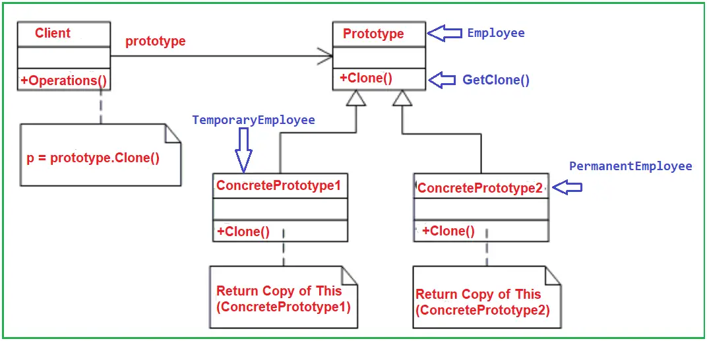

C# Prototype Design Pattern
The Prototype design pattern specifies the kind of objects to create using a prototypical instance, and create new objects by copying this prototype. 
>Prototype : A fully initialized instance to be copied or cloned

## UML class diagram

* Prototype: declares an interface for cloning itself
* ConcretePrototype: implements an operation for cloning itself
* Client: creates a new object by asking a prototype to clone itself

## UML class diagram with example

* Prototype: This will be an interface or abstract class used for the types of objects that can be cloned. In our example, it is going to be the Employee Abstract Class.
* ConcretePrototype: This class will implement the Prototype abstract class or interface for cloning. In our example, it will be the PermanetEmployee and TemporaryEmployee Classes.
* Client: The client is the class that creates a new object by asking a prototype to clone itself.

## Shallow copy and deep copy in prototype patterns

There are two types of cloning for prototype patterns. One is the shallow cloning which you have just read in the first question. In shallow copy only that object is cloned, any objects containing in that object is not cloned. For instance consider the figure 'Deep cloning in action' we have a customer class and we have an address class aggregated inside the customer class. 'MemberWiseClone' will only clone the customer class 'ClsCustomer' but not the 'ClsAddress' class. So we added the 'MemberWiseClone' function in the address class also. Now when we call the 'getClone' function we call the parent cloning function and also the child cloning function, which leads to cloning of the complete object. When the parent objects are cloned with their containing objects it's called as deep cloning and when only the parent is clones its termed as shallow cloning.