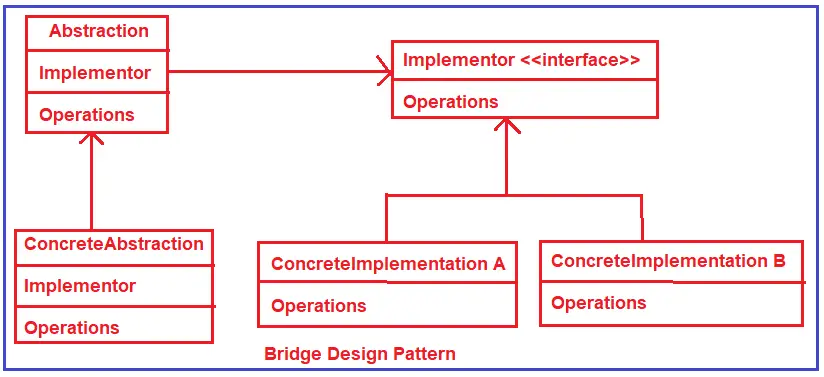
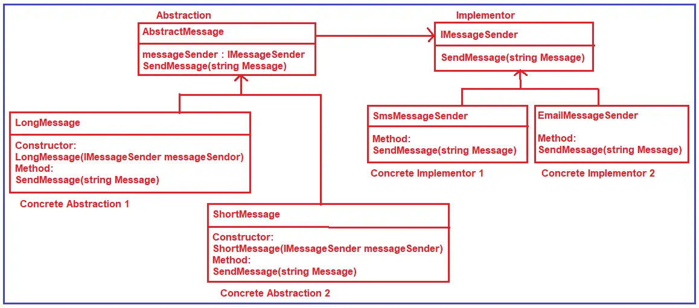

# C# Bridge Design Pattern
The Bridge design pattern decouples an abstraction from its implementation so that the two can vary independently.  
>Bridge : Separates an object's abstraction from its implementation.  

## UML class diagram

* Implementer: This is an interface, and all the implementation classes must implement this interface. This interface is going to act as a bridge between the abstraction classes and the implementer classes.  
* ConcreteImplementationA / ConcreteImplementaionB: These will be classes and implement the Implementor interface.
* Abstraction: This is going to be an abstract class.  
* ConcreteAbstraction / RefinedAbstraction: ConcreteAbstractions are the concrete classes inherited from the Abstraction abstract class. 

## UML class diagram with example
