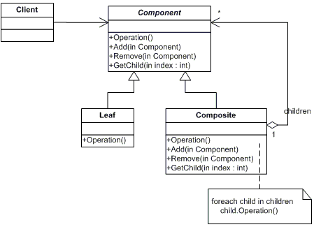
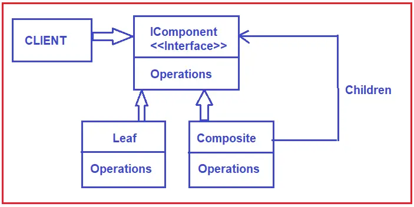
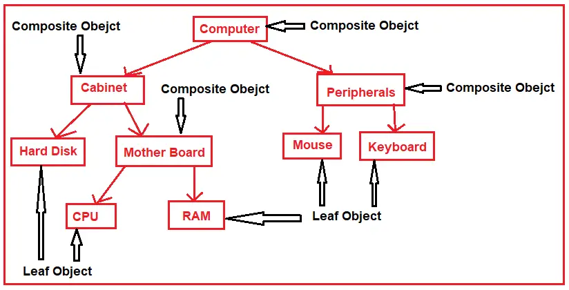

# C# Composite Design Pattern
The Composite design pattern composes objects into tree structures to represent part-whole hierarchies. This pattern lets clients treat individual objects and compositions of objects uniformly.  
>Composite : A tree structure of simple and composite objects. 

## UML class diagram

* Component Interface: Define an interface or abstract class for implementing the composites and leaf nodes.
* Leaf: Implement the component interface for the leaf nodes with no children.
* Composite: Implement the component interface and also include a collection of components. The composite object can add, remove, and access the child components.
* Client Code: The client works with all elements through the component interface.

## UML class diagram with example

* Component: This will be an abstract class or interface containing the members that will be implemented by both Leaf and Composite Classes. If required, then it can also implement some of the behavior common to all objects in the composition, and in that case, we need to create the Component as an abstract class. That means the abstract class or interface acts as the base class for all the objects within the hierarchy. In our example, it is the IComponent interface.
* Leaf: This class will represent the leaf behavior in the composition. In our example, it is the Leaf class. A leaf object does not have any children.
* Composite: The Composite defines the behavior of the Composite Components. The component is having children. The children can be another composite component or can be a leaf component. In our example, it is the Composite class. This class defines the necessary operations that can be performed on the child components, i.e., Add, Remove, Get, Find, etc. methods.
* Client: The Client is the class that manipulates objects in the composition through the Component interface, i.e., the child classes that implement the Component interface or abstract class. In our example, the Program class is going to be the client.