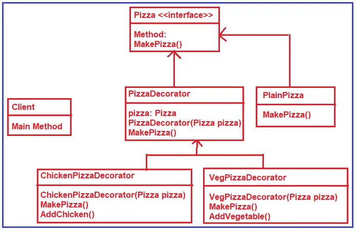

# C# Decorator Design Pattern
The Decorator design pattern attaches additional responsibilities to an object dynamically. This pattern provide a flexible alternative to subclassing for extending functionality.  
>Decorator : Add responsibilities to objects dynamically. 

## UML class diagram

* Component : 
defines the interface for objects that can have responsibilities added to them dynamically.  
* ConcreteComponent : 
defines an object to which additional responsibilities can be attached.  
* Decorator : 
maintains a reference to a Component object and defines an interface that conforms to Component's interface.  
* ConcreteDecorator : 
adds responsibilities to the component.  

## UML class diagram with example
