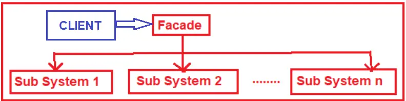
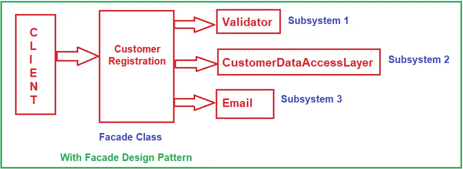

# C# Abstract Facade Design Pattern
The Facade design pattern provides a unified interface to a set of interfaces in a subsystem. This pattern defines a higher-level interface that makes the subsystem easier to use.

## UML class diagram

As shown in the above image, three classes are involved in the Facade Design Pattern. They are as follows:

* The Facade Class knows which subsystem classes are responsible for a given request, and then it delegates the client requests to appropriate subsystem objects.
* The Subsystem Classes implement their respective functionalities assigned to them, and these Subsystem Classes do not know the Facade class.
* The Client Class uses the Façade Class to access the subsystems.

## UML class diagram with example
