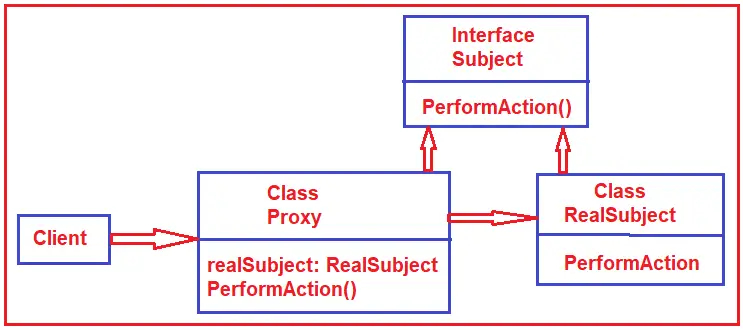

# C# Proxy Design Pattern
The Proxy design pattern provides a surrogate or placeholder for another object to control access to it. 
>Proxy : An object representing another object. 

## UML class diagram

* Proxy  
maintains a reference that lets the proxy access the real subject. Proxy may refer to a Subject if the RealSubject and Subject interfaces are the same.  
provides an interface identical to Subject's so that a proxy can be substituted for for the real subject.  
controls access to the real subject and may be responsible for creating and deleting it.  
other responsibilites depend on the kind of proxy:  
remote proxies are responsible for encoding a request and its arguments and for sending the encoded request to the real subject in a different address space.  
virtual proxies may cache additional information about the real subject so that they can postpone accessing it. For example, the ImageProxy from the Motivation caches the real images's extent.  
protection proxies check that the caller has the access permissions required to perform a request.  
* Subject   
defines the common interface for RealSubject and Proxy so that a Proxy can be used anywhere a RealSubject is expected.
* RealSubject 
defines the real object that the proxy represents.

## UML class diagram with example

* Subject (ISharedFolder): This is an interface that defines the members that will be implemented by the RealSubject and Proxy class so that the Proxy can be used by the client instead of the RealSubject. In our example, it is the ISharedFolder interface.
* RealSubject (SharedFolder): This is a class that we want to use more efficiently by using the proxy class. This class should implement the Subject Interface. In our example, it is the SharedFolder class.
* Proxy (SharedFolderProxy): This class holds a reference to the RealSubject class and can access RealSubjecr class members as required. It must implement the same interface as the RealSubject to use the two interchangeably. In our example, it is the SharedFolderProxy class.
Client: This Client will be a class, and the client class will use the Proxy class.